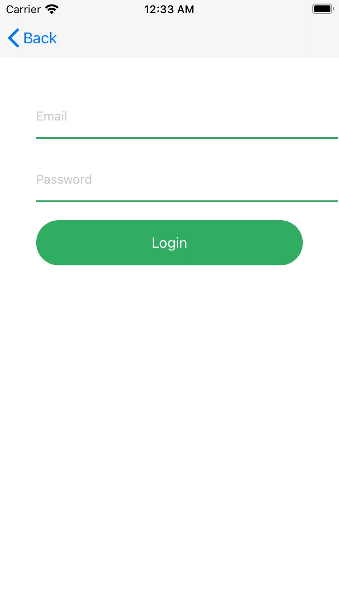
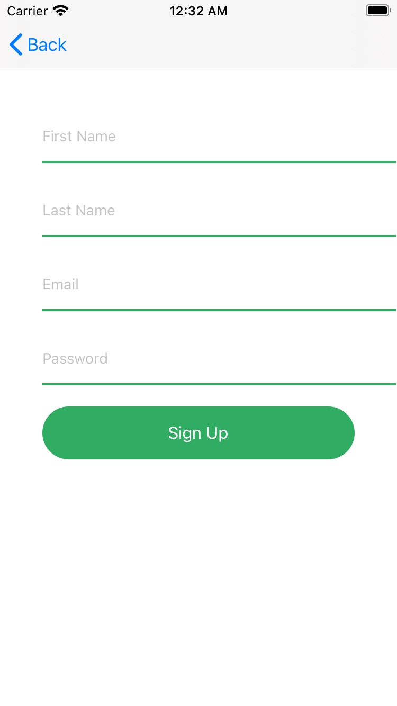
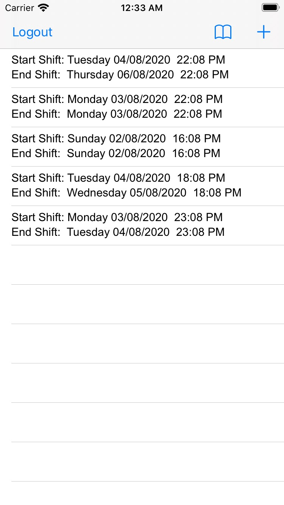
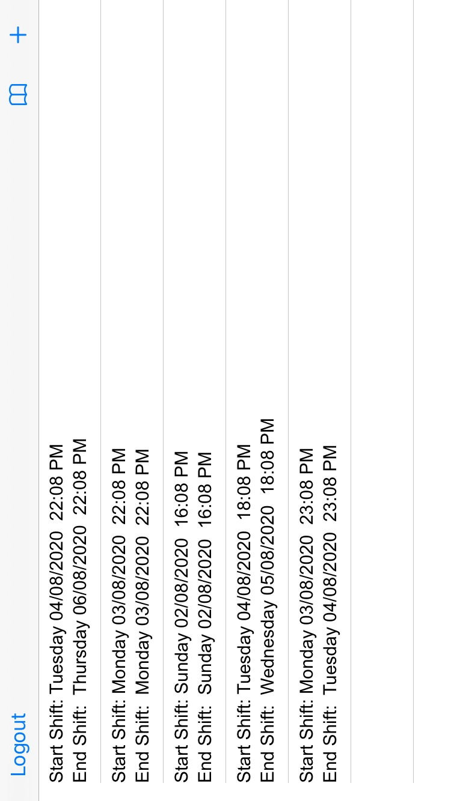
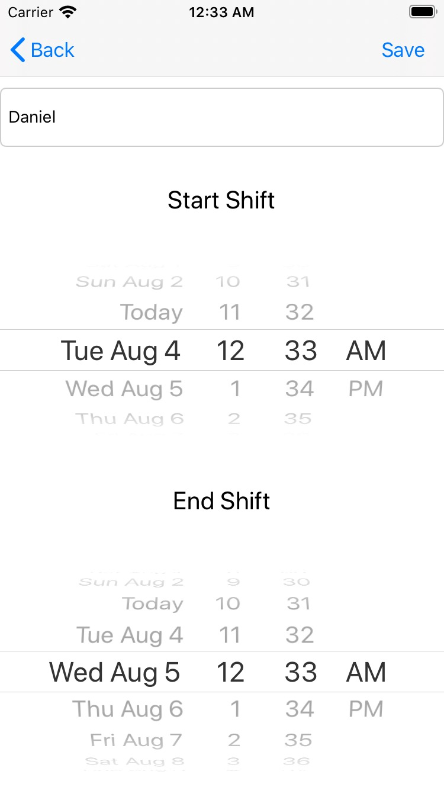
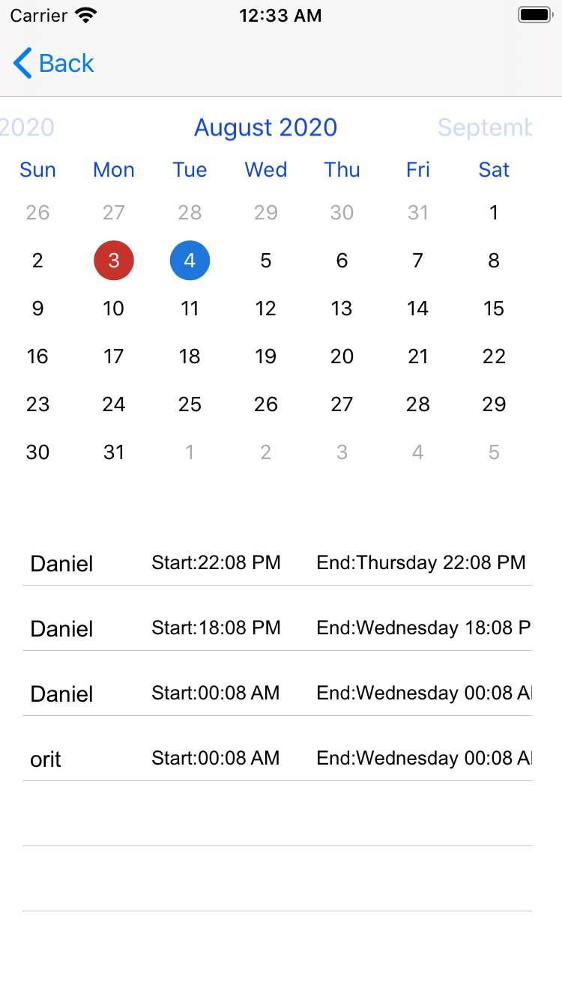
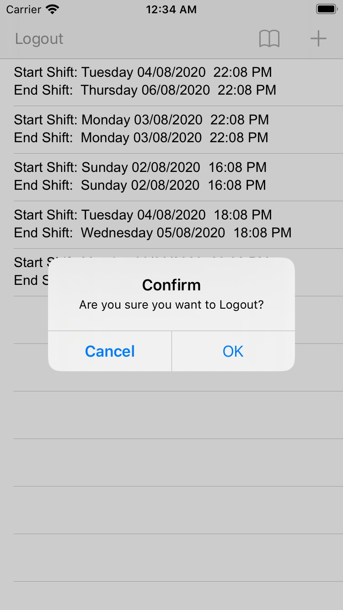

# Shift_Share DanielTabaja - Afeka collage

Hello! 

This is my final project in IOS class.

I made an application for workers and managers to share their shifts and schdule it easily.
Furthermore, i used FSCalender so that the users can watch all the shifts of all the users.

I hope you enjoy the project.

P.S

After download the app you need to do 'pod install'

Comment to guy

Hope you enjoy.

